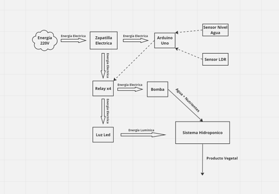

# Proyecto Hidropónico Arduino

## Introducción
En el marco de la constante búsqueda de soluciones innovadoras para la producción de alimentos en entornos urbanos limitados, el presente proyecto se centra en el diseño y desarrollo de un sistema hidropónico automatizado. Este sistema está específicamente concebido para su implementación en un entorno doméstico con restricciones significativas, como la falta de espacio para la plantación tradicional en tierra y la poca luz solar directa en el balcón del departamento.

El contexto de este proyecto se enmarca en la realidad de un departamento donde el espacio disponible para la agricultura convencional es escaso. La elección de la hidroponía como método de cultivo se fundamenta en su capacidad para maximizar el rendimiento en espacios reducidos y prescindir del uso del suelo. La pocas horas de luz solar directa en el balcón del departamento presenta un desafío adicional, y por ende, se incorpora una pantalla de iluminación LED como parte integral del sistema, proporcionando la iluminación adicional necesaria para el crecimiento saludable de las plantas.

Además, se reconoce la necesidad de autonomía en el sistema, dado que los habitantes del domicilio disponen de tiempo limitado para atender el huerto. La automatización se convierte en una pieza clave para garantizar el funcionamiento eficiente del sistema hidropónico sin requerir una supervisión constante. La integración de tecnologías como la placa Arduino Uno, el sensor de nivel de agua, el sensor de luz y otros componentes especializados permite gestionar de manera autónoma el riego, la iluminación y otros aspectos cruciales para el desarrollo de las plantas.

Este proyecto no solo busca proporcionar una solución práctica para la producción de alimentos en entornos urbanos con limitaciones espaciales, sino que también aborda la necesidad de sistemas agrícolas independientes, adaptándose al estilo de vida de los habitantes y permitiéndoles disfrutar de los beneficios de un huerto casero sin comprometer su apretada agenda. A lo largo de este informe, se detallarán los componentes, el diseño y la implementación de este sistema, destacando su relevancia en la convergencia entre la tecnología y la agricultura urbana.

## Objetivos
### Objetivos Generales
Desarrollar un sistema hidropónico automatizado, integrando tecnologías como Arduino Uno, para la producción eficiente de alimentos en un entorno doméstico con limitaciones de espacio y luz solar.
### Objetivos Específicos
1. Diseñar e implementar un sistema hidropónico utilizando una placa Arduino Uno y componentes especializados.
2. Integrar un sensor de nivel de agua para gestionar eficientemente el riego automático del cultivo.
3. Incorporar una advertencia tanto lumínica como sonora ante escasez de agua para el correcto funcionamiento del sistema.
4. Seleccionar y utilizar una bomba de agua sumergible de alta capacidad para garantizar el flujo adecuado en el sistema hidropónico.
5. Integrar un sensor de luz y un plafón LED para crear condiciones lumínicas ideales para el crecimiento de las plantas en ausencia de luz solar directa.
6. Configurar una pantalla LCD con módulo I2C como interfaz de usuario para la monitorización en tiempo real del sistema.
7. Lograr la autonomía del sistema, permitiendo su funcionamiento eficiente con supervisión mínima, adaptándose al estilo de vida de los habitantes del domicilio.

## Diagrama por Bloques

## Componentes necesarios
- Arduino Uno
- Protoboard 830 puntos
- Modulo Relay x4
- Buzzer sfm-27
- Pantalla lcd 1602A
- Módulo I2C
- Led
- Resistencias
- Cables dupont H-M
- Cables dupont M-M
- Sensor de Nivel de Agua OKY 3446
- Sensor LDR 5528

## Funcionamiento
Con el objetivo de automatizar un sistema hidropónico, el diseño se centra en la eficiencia y el ahorro de recursos. El sistema opera de la siguiente manera:
1. Luz Solar:
   Durante las horas de luz solar directa, la iluminación LED permanece apagada para aprovechar la iluminación natural.
2. Iluminación Artificial:
   - Fuera del horario de luz solar directa (8 a 18 horas), la luz LED se enciende automáticamente mediante el sensor LDR, garantizando un suministro constante de luz para el sistema.
3. Sensor de Nivel de Agua:
   - El recipiente de agua está equipado con un sensor de nivel que detecta la falta de agua.
   - Cuando el sensor identifica niveles bajos, se detiene el funcionamiento de la bomba para evitar su operación en vacío.
   - Alerta por Falta de Agua:
     En caso de falta de agua, se activa un buzzer y un LED rojo destella, alertando al usuario sobre la interrupción del sistema de riego.
Este enfoque integrado y automatizado mejora la eficiencia del sistema hidropónico al optimizar el uso de recursos y proporcionar alertas visuales y auditivas pertinentes.

### Gracias por ver!
